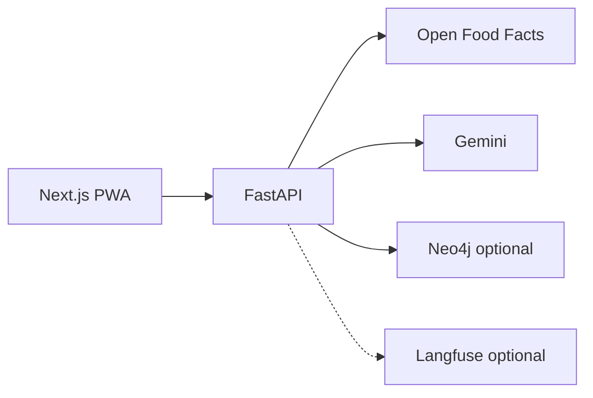

# SnapInsight

**AI Visual Companion for Products** — mobile-first PWA + FastAPI backend for cited, multimodal product intelligence (food & CPG).

**Live demo:** [https://project-2-wine-seven.vercel.app](https://project-2-wine-seven.vercel.app) · [Scan](https://project-2-wine-seven.vercel.app/scan) — see [docs/demo-guide.md](./docs/demo-guide.md).

**Backend health:** [https://snapinsight-backend-87dm.onrender.com/health](https://snapinsight-backend-87dm.onrender.com/health)

**Stack:** Next.js PWA (Vercel) · FastAPI (Render) · Gemini 2.5 Flash · Open Food Facts · optional Neo4j GraphRAG Lite · optional Langfuse.

---

SnapInsight is a **cost-controlled, production-like deployed demo**: users photograph or upload packaged products and receive structured analysis with **Open Food Facts citations** when matched, plus contextual chat, compare, and a lightweight product graph. Built as a real product workflow—not a one-shot vision API demo.

## What it does

1. **Capture** — camera or upload on a mobile-first PWA
2. **Analyze** — real Gemini multimodal analysis when configured (`gemini` mode)
3. **Ground** — conservative Open Food Facts matching with citations
4. **Interact** — product-scoped chat, compare, GraphRAG Lite
5. **Observe** — in-app metrics + optional Langfuse traces (safe metadata only)

## Core features

| Feature | Description |
|---------|-------------|
| Vision-first scan | Upload/camera—not barcode-only |
| Grounded insights | Open Food Facts citations + enrichment |
| Contextual chat | Follow-ups on current product context |
| Compare Mode Lite | Side-by-side product diff |
| GraphRAG Lite | Neo4j Aura + in-memory fallback |
| Voice Lite | Browser speech (no server audio) |
| Cost controls | Session + daily limits, cache, estimated spend cap |
| Status & metrics | `/v1/metrics/summary` + in-app panel |

## Architecture



Details: [docs/architecture.md](./docs/architecture.md) · [docs/case-study.md](./docs/case-study.md)

## Run locally

**Frontend:**

```bash
npm install
cp .env.example .env.local   # set NEXT_PUBLIC_SNAPINSIGHT_API_URL
npm run dev
```

**Backend:**

```bash
cd backend
pip install -r requirements.txt
cp .env.example .env         # SNAPINSIGHT_ANALYSIS_MODE=mock for zero-cost dev
SNAPINSIGHT_ANALYSIS_MODE=mock uvicorn app.main:app --reload --host 127.0.0.1 --port 8000
```

Open `http://localhost:3000` with backend at `http://127.0.0.1:8000`.

## Deploy

| Target | Guide |
|--------|-------|
| Render (backend) | [docs/DEPLOYMENT.md](./docs/DEPLOYMENT.md) |
| Vercel (frontend) | [docs/DEPLOYMENT.md](./docs/DEPLOYMENT.md) |
| Env vars | [docs/ENV_VARS.md](./docs/ENV_VARS.md) |
| Smoke test | [docs/smoke-test.md](./docs/smoke-test.md) · `scripts/smoke_check.py` |

**Production demo:** `SNAPINSIGHT_ANALYSIS_MODE=gemini` + server-side `GEMINI_API_KEY` on Render only.

## Cost & privacy

- Session and daily usage limits for the public demo
- In-memory cache (responses only, not images)
- No persistent user accounts or image storage
- EXIF strip in browser where supported
- API keys backend-only

[docs/PRIVACY_AND_COST_CONTROLS.md](./docs/PRIVACY_AND_COST_CONTROLS.md) · [docs/cost-privacy-safety.md](./docs/cost-privacy-safety.md)

## Analysis modes

| Mode | Purpose |
|------|---------|
| `mock` | Zero-cost local dev / CI |
| `gemini` | Real multimodal analysis (production) |
| `mock_fallback` | Opt-in labeled fallback when Gemini fails |

## Limitations (honest)

Not medical advice. No guaranteed identification. Open Food Facts coverage varies. **Not published on Play Store or App Store.** No accounts/payments. Gemini Live is **access-code gated** and experimental. Render free tier may cold-start. See [docs/limitations.md](./docs/limitations.md).

## Next steps

- Gemini Live — experimental optional wow feature ([docs/ROADMAP_NEXT_STEPS.md](./docs/ROADMAP_NEXT_STEPS.md))
- Store readiness documented, not executed ([docs/MOBILE_STORE_READINESS.md](./docs/MOBILE_STORE_READINESS.md))

## Evidence & final package

Production runs **Gemini real analysis** (`SNAPINSIGHT_ANALYSIS_MODE=gemini`), **usage/cost limits**, and **privacy guardrails** (no image storage, local JSON only). Gemini Live is ready but **access-code gated**.

| Resource | Link |
|----------|------|
| Final package | [docs/FINAL_PROJECT_PACKAGE.md](./docs/FINAL_PROJECT_PACKAGE.md) |
| Business brief | [docs/BUSINESS_BRIEF.md](./docs/BUSINESS_BRIEF.md) |
| Demo script (60–90s) | [docs/DEMO_SCRIPT.md](./docs/DEMO_SCRIPT.md) |
| Screenshot guide | [docs/SCREENSHOT_CAPTURE_GUIDE.md](./docs/SCREENSHOT_CAPTURE_GUIDE.md) |
| Screenshot manifest | [docs/evidence/screenshots/README.md](./docs/evidence/screenshots/README.md) |

**Capture screenshots:** `npm run evidence:screenshots` (requires Playwright Chromium).

### Screenshots (after capture)

**Mobile:** [scan](./docs/evidence/screenshots/mobile/01-scan-empty-or-upload.png) · [Gemini result](./docs/evidence/screenshots/mobile/02-scan-gemini-result.png) · [insights](./docs/evidence/screenshots/mobile/03-insights-latest-analysis.png) · [compare](./docs/evidence/screenshots/mobile/04-compare-workflow.png) · [activity](./docs/evidence/screenshots/mobile/05-activity-metrics-limits.png) · [graph](./docs/evidence/screenshots/mobile/06-graph-evidence-no-minimap.png) · [Live gated](./docs/evidence/screenshots/mobile/07-gemini-live-ready-access-gated.png)

**Desktop:** [scan](./docs/evidence/screenshots/desktop/01-home-or-scan-desktop.png) · [result](./docs/evidence/screenshots/desktop/02-scan-result-desktop.png) · [activity](./docs/evidence/screenshots/desktop/03-activity-dashboard-desktop.png) · [compare](./docs/evidence/screenshots/desktop/04-compare-desktop.png)

## Documentation

| Document | Description |
|----------|-------------|
| [docs/DEPLOYMENT.md](./docs/DEPLOYMENT.md) | Render + Vercel deploy |
| [docs/ENV_VARS.md](./docs/ENV_VARS.md) | Environment reference |
| [docs/QA_FINAL.md](./docs/QA_FINAL.md) | Final audit checklist & results |
| [docs/FINAL_PROJECT_PACKAGE.md](./docs/FINAL_PROJECT_PACKAGE.md) | Close-out package index |
| [docs/BUSINESS_BRIEF.md](./docs/BUSINESS_BRIEF.md) | Product & market brief |
| [docs/DEMO_SCRIPT.md](./docs/DEMO_SCRIPT.md) | 60–90s demo script |
| [docs/SCREENSHOT_CAPTURE_GUIDE.md](./docs/SCREENSHOT_CAPTURE_GUIDE.md) | Evidence capture runbook |
| [docs/PRIVACY_AND_COST_CONTROLS.md](./docs/PRIVACY_AND_COST_CONTROLS.md) | Limits, cache, privacy |
| [docs/ROADMAP_NEXT_STEPS.md](./docs/ROADMAP_NEXT_STEPS.md) | Post-close-out roadmap |
| [docs/MOBILE_STORE_READINESS.md](./docs/MOBILE_STORE_READINESS.md) | Play/App path (not published) |
| [docs/demo-guide.md](./docs/demo-guide.md) | Demo runbook |
| [docs/portfolio-pitch.md](./docs/portfolio-pitch.md) | Interview pitch |

## Current status

**Final evidence packaging.** Gemini real mode, usage/cost guardrails, and gated Gemini Live on production. Evidence capture via Playwright; see [docs/FINAL_PROJECT_PACKAGE.md](./docs/FINAL_PROJECT_PACKAGE.md).

---

*SnapInsight — show the product, see cited intelligence, decide with context.*
