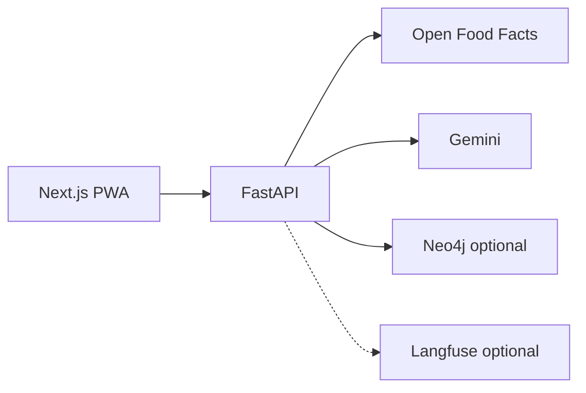

# SnapInsight

**AI Visual Companion for Products** — deployed mobile-first PWA + FastAPI backend for cited, multimodal product intelligence (food & CPG).

**Live demo:** Set your Vercel Production URL (e.g. `https://YOUR_FRONTEND.vercel.app`) — see [docs/demo-guide.md](./docs/demo-guide.md).
**Stack:** Next.js PWA (Vercel) · FastAPI (Render) · Open Food Facts · optional Neo4j GraphRAG Lite · Gemini (feature-flagged) · optional Langfuse.

---

SnapInsight lets users photograph or upload packaged products and receive structured analysis with **Open Food Facts citations** when matched, plus contextual chat, side-by-side compare, and a lightweight product graph. It is production-deployed with smoke-tested health/metrics/Live-disabled paths, intentional cost-safe analysis modes, and aggregate-only observability—built as a real product workflow, not a one-shot vision API demo.

## What it does

1. **Capture** — camera or upload on a mobile-first PWA
2. **Analyze** — multimodal structured insights (`mock`, `gemini`, or visible `mock_fallback`)
3. **Ground** — conservative Open Food Facts matching with citations
4. **Interact** — product-scoped chat, compare, GraphRAG Lite
5. **Observe** — in-app metrics + optional Langfuse traces (safe metadata only)

## Why it matters

Shoppers and product teams lose time to **unclear labels** and **uncited AI answers**. SnapInsight focuses on **traceable product intelligence**: sources on the card, explicit uncertainty, compare for decisions, and operational visibility—without medical claims or counterfeit assertions. It can support faster understanding in categories where open data coverage is strong ([business case](./docs/business-case.md)).

## Core features

| Feature | Description |
|---------|-------------|
| Vision-first scan | Upload/camera—not barcode-only |
| Grounded insights | Open Food Facts citations + enrichment |
| Contextual chat | Follow-ups on current product context |
| Compare Mode Lite | Side-by-side product diff |
| GraphRAG Lite | Neo4j Aura + in-memory fallback |
| Voice Lite | Browser speech (no server audio) |
| Status & metrics | `/v1/metrics/summary` + in-app panel |
| LLMOps (optional) | Langfuse aggregate traces |

## Architecture overview

Details: [docs/architecture.md](./docs/architecture.md) · [docs/case-study.md](./docs/case-study.md)

## Production readiness

- Deployed pattern: **Vercel** (frontend) + **Render** (backend)
- Smoke checks: health, metrics, Live config, compare/graph synthetics, CORS ([docs/smoke-test.md](./docs/smoke-test.md))
- Block 19A: Preview CORS regex, cold-start retries, troubleshooting ([docs/deploy.md](./docs/deploy.md))
- **Gemini Live:** implemented, **disabled by default** (`GET /v1/live/config` → `enabled: false`)

## Observability

When Langfuse is enabled, each analysis request can produce a trace with: `analysis_mode`, `cache_hit`, `grounding_status`, `citations_count`, `warnings_count`, `graph_backend`, `fallback_used`, `latency_ms`, and `error_type` if applicable. **No** image bytes, base64, raw prompts, transcripts, API keys, or PII. Tracing is optional and non-blocking. See [docs/llmops.md](./docs/llmops.md).

## Analysis modes (`mock` / `gemini` / `mock_fallback`)

| Mode | Purpose |
|------|---------|
| **`mock`** | Deterministic zero-cost demos, CI, local dev |
| **`gemini`** | Real multimodal analysis (server-side API key) |
| **`mock_fallback`** | Opt-in labeled fallback when Gemini fails; **not cached** |

This three-mode design keeps demos honest and production degradations visible. Activation: [docs/demo-guide.md](./docs/demo-guide.md).

## Demo flow

1. Open Production PWA → Scan → upload a packaged product image
2. Review insight card (mode, confidence, citations)
3. Chat → Compare → Graph
4. Optional: Langfuse trace + metrics panel

Full script: [docs/demo-guide.md](./docs/demo-guide.md)

## Tech stack

| Layer | Technology |
|-------|------------|
| Frontend | Next.js, Tailwind, shadcn/ui, PWA |
| Backend | FastAPI (Python 3.11+) |
| AI | Gemini (feature-flagged); mock paths |
| Data | Open Food Facts; optional Neo4j Aura |
| Observability | Langfuse (optional); in-memory metrics |
| Hosting | Vercel + Render |

Full spec: [SPEC.md](./SPEC.md)

## Cost & privacy controls

- Mock default for low-cost demos; cache stores **responses only** (hashed keys, not images)
- No persistent user accounts or uploaded image storage
- Gemini Live off by default; ephemeral tokens when enabled
- [docs/cost-privacy-safety.md](./docs/cost-privacy-safety.md)

## Limitations

Not medical advice. No guaranteed identification. Open Food Facts coverage varies. No app store listing yet. No accounts/payments. See [docs/limitations.md](./docs/limitations.md).

## Roadmap

Phased scaling (controlled Gemini → data coverage → history → mobile packaging → B2B API): [docs/scaling-roadmap.md](./docs/scaling-roadmap.md) · delivery blocks: [docs/roadmap.md](./docs/roadmap.md)

## Documentation

| Document | Description |
|----------|-------------|
| [docs/case-study.md](./docs/case-study.md) | Problem, architecture, decisions, lessons |
| [docs/business-case.md](./docs/business-case.md) | Market, personas, monetization (conservative) |
| [docs/business-metrics.md](./docs/business-metrics.md) | Metric definitions (not fake results) |
| [docs/portfolio-pitch.md](./docs/portfolio-pitch.md) | Hiring / interview pitch |
| [docs/product-positioning.md](./docs/product-positioning.md) | Positioning guardrails |
| [docs/demo-guide.md](./docs/demo-guide.md) | Deployed demo runbook |
| [docs/product/snapinsight-business-product-brief.md](./docs/product/snapinsight-business-product-brief.md) | Research brief source of truth |
| [docs/mobile-packaging.md](./docs/mobile-packaging.md) | PWA → TWA → Capacitor path |
| [docs/screenshots-and-video-checklist.md](./docs/screenshots-and-video-checklist.md) | Media capture placeholders |
| [docs/deploy.md](./docs/deploy.md) | Environment variables & deploy |
| [docs/troubleshooting.md](./docs/troubleshooting.md) | CORS, cold start, modes |
| [docs/llmops.md](./docs/llmops.md) | Langfuse setup |
| [docs/gemini-live.md](./docs/gemini-live.md) | Live activation (off by default) |

## Current status

**Block 20A — Final product package documentation.** Premium README and business/product docs; no runtime feature changes. Gemini and Gemini Live remain disabled unless the deployment owner activates them.

---

*SnapInsight — show the product, see cited intelligence, decide with context.*
