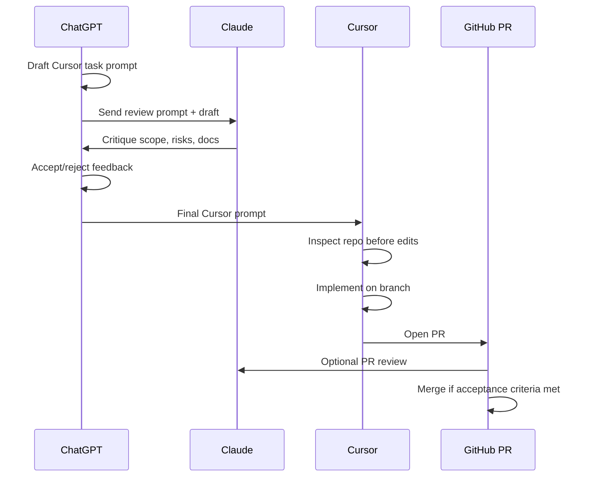

# SnapInsight — AI Development Workflow

This document defines how humans and AI tools collaborate on SnapInsight. It keeps context in the repo (`SPEC.md`, `docs/`) instead of repeating large prompts every session.

## Workflow

### Steps

1. **ChatGPT** drafts the Cursor implementation prompt from `SPEC.md` and the target roadmap block.
2. **ChatGPT** drafts a **Claude review prompt** (scope, risks, doc gaps, safety).
3. **Claude** critiques: scope creep, missing limitations, architecture fit.
4. **ChatGPT** accepts or rejects review comments; produces the **final Cursor prompt**.
5. **Cursor** inspects the repository (structure, existing files, conflicts) **before** writing code.
6. **Cursor** implements on a feature branch and opens a PR.
7. **PR review** (human and/or Claude) against block acceptance criteria.
8. **Merge** when criteria pass and limitations remain documented.

## Tool roles

| Tool | Role |
|------|------|
| **ChatGPT** | Architect, planner, QA checklist, prompt generator |
| **Claude** | Critical reviewer, doc curator, scope guard |
| **Cursor** | Primary implementer (Composer), repo-aware edits |
| **Google AI Studio** | Multimodal prompt prototyping (isolated from production keys) |
| **v0 / Stitch** | Optional UI acceleration; output must match project conventions |

## Efficiency rules

- **Do not paste giant context** every session—point to `SPEC.md` and relevant `docs/` files.
- **One task ≈ one branch ≈ one PR** when possible.
- **No scope creep:** if a task is Block 2, do not add Block 6 RAG.
- **Inspect before edit:** list what exists and what will change.
- **Preserve limitations:** never remove disclaimers or non-goals to “ship faster.”
- **No secrets in prompts or commits.**

## Block-aware implementation

| Phase | Cursor should |
|-------|----------------|
| Block 0 | Docs and rules only |
| Block 1–2 | Frontend shell; no provider API keys |
| Block 3 | Backend stub; OpenAPI only |
| Block 4+ | Integrate AI only when block explicitly requires it |

## Review checklist (per PR)

- [ ] Matches stated block acceptance criteria in `SPEC.md` / `docs/roadmap.md`
- [ ] No implied “already shipped” language in docs touched by the PR
- [ ] No invented latency, accuracy, or cost metrics
- [ ] Limitations and safety boundaries preserved
- [ ] Dependencies added only if the block requires them

## References

- Product spec: [SPEC.md](../SPEC.md)
- Architecture: [architecture.md](./architecture.md)
- Roadmap: [roadmap.md](./roadmap.md)
- Cursor rules: [.cursor/rules/snapinsight.mdc](../.cursor/rules/snapinsight.mdc)
