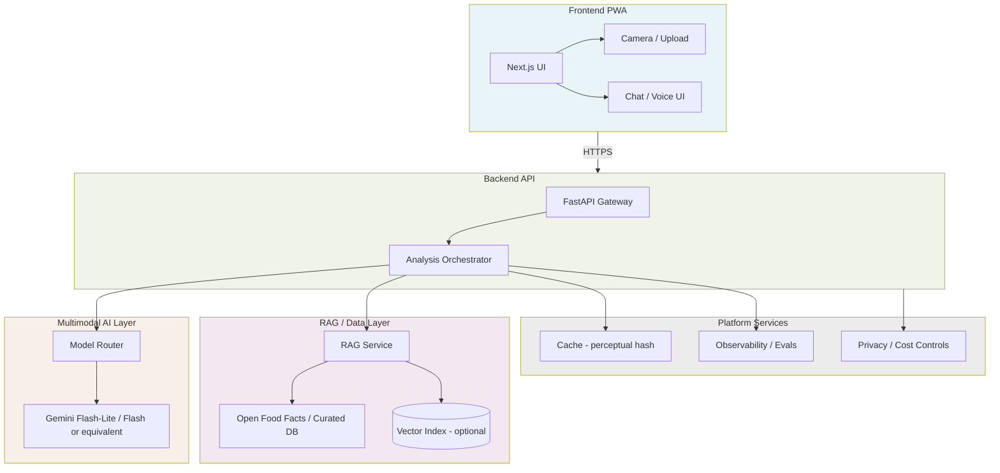

# SnapInsight — Target Architecture

> **Status:** Target architecture for planning only. Nothing below is implemented in Block 0.

## Overview

SnapInsight follows an **API-first, cloud-first** strategy: a thin, installable PWA talks to a backend that orchestrates multimodal inference, retrieval, caching, and observability. The system is designed to ship value without local model fine-tuning—grounding and citations come from structured open data plus careful prompting and UX.

## Architecture diagram

## Layers

### Frontend PWA

- Next.js application with Tailwind and shadcn/ui components.
- Mobile-first layouts: capture, product card, chat drawer, settings.
- Client-side EXIF stripping (planned) before upload.
- Service worker for offline shell only where appropriate; analysis requires network.

### Backend API

- FastAPI service exposing versioned REST (or JSON-RPC) endpoints.
- Responsibilities: validate uploads, orchestrate analysis pipeline, enforce rate limits, hold API keys.
- Contract-first: OpenAPI schema shared with frontend (future block).

### Multimodal AI layer

- Cloud multimodal model for image + text understanding.
- Planned routing: cost-efficient model for default path; stronger model on low-confidence retry (future block).
- Structured output schema for product fields (name, brand, ingredients summary, allergens hints, etc.).

### RAG / data layer

- Primary grounding: Open Food Facts (barcode, ingredients, allergens, Nutri-Score, images, metadata).
- Optional vector search over embedded product records for fuzzy visual-to-product matching.
- Every surfaced fact from retrieval should carry citation metadata for the UI.

### Cache / model router

- Perceptual hash of images to avoid duplicate multimodal calls (future block).
- Session-scoped and global cache policies with TTL.
- Model router selects tier based on confidence, cost budget, and feature flags.

### Observability / evals

- Trace each request: latency, model used, retrieval hits, confidence, estimated cost.
- Langfuse or equivalent for development and demo dashboards.
- Golden-set evals for regression on identification and citation quality (future block).

### Privacy / cost controls

- Server-side secrets only.
- Ephemeral image storage; no PII by default.
- Rate limits, spend caps, retry with backoff.
- Safety prompts and output filters for health and authenticity boundaries.

## Why not depend on local fine-tuning?

- **Time to value:** API multimodal models already interpret packaging and labels; RAG supplies factual grounding.
- **Maintainability:** No GPU training pipeline, dataset versioning for weights, or model hosting burden in early blocks.
- **Evidence:** Citations come from datasets and retrieval, not from opaque weights.
- **Cost:** Fine-tuning adds complexity before product-market fit for the UX; cloud APIs with caching fit the initial cost envelope.

Fine-tuning or distillation may be reconsidered only if API grounding proves insufficient—and only as an explicit future decision, not a Block 0–4 assumption.

## Deployment topology (target)

| Component | Target host |
|-----------|-------------|
| PWA | Vercel or equivalent |
| API + workers | Modal, Render, Railway, Fly, or similar |
| Database / vectors | Supabase, Neon, or managed Postgres (if needed) |
| Observability | Langfuse Cloud or self-hosted |

Exact provider choices are documented in [SPEC.md](../SPEC.md) and may change after quota verification.

## API-first principles

- Frontend never holds provider API keys.
- All multimodal and retrieval calls go through the backend.
- Versioned API for future native wrappers or partners.
- Idempotent analysis requests where caching applies.
