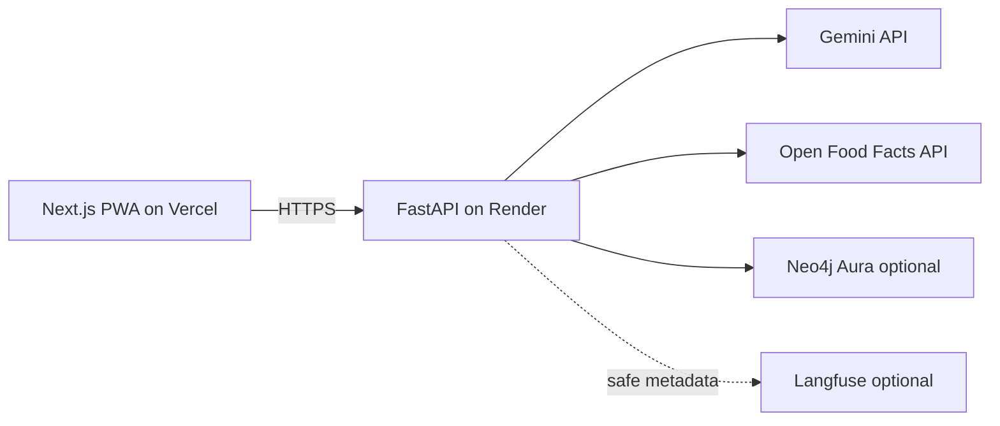

# SnapInsight — Case Study

**AI Visual Companion for Products** — a mobile-first PWA with FastAPI backend, Open Food Facts grounding, compare/chat/graph flows, optional Langfuse tracing, and deployment hardening on Vercel + Render.

This case study describes **what was built**, **why**, and **what remains assumption or future work**. It does not claim measured business outcomes.

---

## Problem

Shoppers and product teams struggle with **incomplete labels**, **scattered data sources**, and **tools that do not cite provenance**. General visual search and generic chat lack a structured product workflow with confidence, compare, and operational observability.

SnapInsight tests the hypothesis that a **camera-first, cited, multimodal companion** for packaged CPG can deliver useful intelligence without medical claims or counterfeit assertions.

---

## Product hypothesis

If users can photograph a product and receive **structured insights grounded in Open Food Facts** (when matched), with **explicit uncertainty**, **contextual chat**, and **compare**, they can make faster, better-informed (non-medical) decisions—and internal teams can reduce manual lookup friction.

---

## Architecture (as deployed)

- **Frontend:** Next.js App Router, Tailwind, shadcn/ui, PWA manifest, mobile-first routes (scan, chat, compare, graph, status).
- **Backend:** FastAPI orchestrates analysis, grounding, enrichment, chat, compare, graph sync, cache, metrics, optional Live token minting.
- **Data:** Open Food Facts for citations; optional Neo4j for GraphRAG Lite with in-memory fallback.
- **Observability:** Optional Langfuse; in-app `/v1/metrics/summary` for operational counters.

See [architecture.md](./architecture.md) for the broader target diagram.

---

## Key product decisions

| Decision | Rationale |
|----------|-----------|
| PWA before native stores | Faster iteration, one codebase, HTTPS demo without store review |
| Server-side Gemini | API keys never in the browser |
| Open Food Facts first | Open, citable CPG data with known license terms |
| Visible analysis modes | Honest demos and operability (`mock` / `gemini` / `mock_fallback`) |
| Gemini Live behind flags | Full integration without default cost/risk activation |
| No user database in MVP | Privacy and scope control; cache/metrics in-process only |

---

## Engineering trade-offs and key decisions

### Cloud-first API over local model hosting

| | |
|---|---|
| **Chosen** | Google Gemini (and mock paths) via cloud API from Render |
| **Alternative** | Self-hosted open vision models on GPU |
| **Why** | No dedicated GPU ops for a portfolio/MVP scope; cloud APIs match multimodal needs; mock modes enable CI and zero-cost demos |

### `mock_fallback` as a first-class product feature

| | |
|---|---|
| **Chosen** | Opt-in `mock_fallback` with visible `mode` in responses; fallback results excluded from cache |
| **Alternative** | Silent error or generic 503 only |
| **Why** | Controlled resilience during Gemini outages or key misconfiguration without pretending live analysis succeeded |

### Ephemeral tokens for Gemini Live (not backend media proxy)

| | |
|---|---|
| **Chosen** | Backend mints constrained v1alpha ephemeral tokens; browser WebSocket to Gemini |
| **Alternative** | Proxy audio/video through FastAPI |
| **Why** | Reduces backend bandwidth, storage, and PHI-style media handling on Render; keys stay server-side |

### Cache key strategy (exact digest today)

| | |
|---|---|
| **Chosen** | SHA256 digest of image bytes + mode + model version for in-memory LRU cache |
| **Alternative** | Perceptual hash for near-duplicate images (documented in target architecture) |
| **Why** | Simpler v1 implementation with no risk of caching different products that look similar; perceptual hashing remains a scaling improvement |

### Open Food Facts over dedicated vector DB at this scale

| | |
|---|---|
| **Chosen** | Conservative OFF matching (barcode/name) + API enrichment; no pgvector pipeline in production |
| **Alternative** | Supabase/pgvector or dedicated vector DB for semantic product search |
| **Why** | Sufficient for MVP grounding and citations; avoids another managed service before traffic justifies semantic recall |

### Open Food Facts as grounding source

| | |
|---|---|
| **Chosen** | Primary citation and enrichment layer |
| **Alternative** | Proprietary PIM or paid product graph only |
| **Why** | Open license, large CPG coverage, clear attribution; trade-off is **uneven quality and gaps** in some categories |

---

## AI reliability strategy

- **Structured JSON** outputs from Gemini with schema validation paths.
- **Grounding layer** when OFF match exists; UI shows citations and warnings.
- **Confidence UX** and possible matches—not hidden low-quality states.
- **Three analysis modes** so operators always know what ran.
- **Offline golden-set fixtures** (Block 14/15) for regression without live API calls.

---

## Grounding and citations

When a conservative Open Food Facts match exists, the product card enriches from OFF records and displays **source links/IDs**. When no match exists, the UI remains graceful (`no_match`) without inventing a citation.

Community data limitations are documented in [limitations.md](./limitations.md).

---

## Observability

Each analysis request can produce a Langfuse trace containing: `analysis_mode` (`gemini`/`mock`/`mock_fallback`), `cache_hit` (boolean), `grounding_status`, `citations_count`, `warnings_count`, `graph_backend`, `fallback_used`, `latency_ms`, and `error_type` if applicable. No image bytes, base64, raw prompts, transcripts, API keys, or PII are logged. Tracing is optional and non-blocking—the app functions normally if Langfuse is disabled or misconfigured.

Chat, compare, graph, and Live lifecycle emit similarly bounded metadata. See [llmops.md](./llmops.md).

---

## Privacy and cost controls

- No persistent image storage; hashed cache keys only.
- Mock mode for zero API spend demos.
- Gemini Live disabled by default; session caps and optional access code when enabled.
- Client EXIF strip/resize before upload where supported.

See [cost-privacy-safety.md](./cost-privacy-safety.md).

---

## Deployment hardening (Block 19A)

- Vercel Production/Preview require `NEXT_PUBLIC_SNAPINSIGHT_API_URL`.
- Render CORS: exact production origins + optional scoped Preview regex.
- Smoke script: health, metrics, Live config, compare/graph synthetics, CORS preflight, cold-start retries.
- Troubleshooting docs for API/CORS vs. model failures.

See [audits/block-19a-production-stability-audit.md](./audits/block-19a-production-stability-audit.md).

---

## What is implemented today

| Capability | Status |
|------------|--------|
| PWA scan/upload + camera | Implemented |
| Analysis (`mock` / `gemini` / `mock_fallback`) | Implemented |
| Open Food Facts grounding + enrichment | Implemented |
| Contextual chat | Implemented |
| Compare Mode Lite | Implemented |
| GraphRAG Lite (Neo4j + fallback) | Implemented |
| Voice Lite (browser) | Implemented |
| In-memory cache + metrics | Implemented |
| Optional Langfuse | Implemented |
| Gemini Live | Implemented, **disabled by default** |
| Production deploy path | Documented + smoke-tested pattern |

---

## What is intentionally feature-flagged

| Feature | Default | Activation |
|---------|---------|------------|
| Gemini analysis | Often `mock` in docs/CI; production owner sets `gemini` | `SNAPINSIGHT_ANALYSIS_MODE` + `GEMINI_API_KEY` |
| Mock fallback | Off | `SNAPINSIGHT_ALLOW_MOCK_FALLBACK=true` |
| Langfuse | Off | `SNAPINSIGHT_LLMOPS_ENABLED=true` + keys |
| Gemini Live | Off | `SNAPINSIGHT_GEMINI_LIVE_ENABLED=true` + access code |
| Neo4j graph | On with fallback | `NEO4J_*` or disable graph |

---

## Results / metrics available today

| Signal | Source | Notes |
|--------|--------|-------|
| Operational counters | `GET /v1/metrics/summary` | Process-local; resets on restart |
| Per-request latency | Response `meta.latency_ms` | Not aggregated as SLA |
| Trace metadata | Langfuse (if enabled) | No PII/media |
| Smoke pass/fail | `scripts/smoke_check.py` | Deploy validation |

**No business KPIs** (time saved, deflection, trust scores) are reported as production facts. See [business-metrics.md](./business-metrics.md).

---

## Assumptions (labeled)

- **Assumption:** Production smoke on owner Vercel/Render URLs validates core flows (analyze, chat, compare, graph, Langfuse, Live disabled-safe).
- **Assumption:** CPG categories with barcode matches deliver the best grounding experience.
- **Assumption:** Portfolio/demo value does not require Play Store listing.

---

## Lessons learned

1. **Visible modes beat silent fallback** for trust in AI demos.
2. **CORS and Preview URLs** are as important as model quality for “deployed” credibility.
3. **Citation UX** forces discipline—models alone are insufficient for product intelligence positioning.
4. **Scope blocks** (graph, Live, Langfuse) pay off when each ships with disable flags and docs.

---

## What I would do differently

### 1. Block granularity vs. integration cost

| | |
|---|---|
| **What was done** | Many sequential blocks (UI, API, RAG, graph, Live, LLMOps, stability). |
| **Consequence** | Strong documentation and flags, but repeated touch points across frontend/backend for each feature. |
| **v2** | Fewer, outcome-oriented milestones with shared contract tests earlier. |

### 2. Open Food Facts coverage gaps

| | |
|---|---|
| **What was done** | Single open dataset for grounding. |
| **Consequence** | Strong when barcode exists; weaker for regional/private-label SKUs. |
| **v2** | Curated supplemental dataset or retailer PIM connector behind the same citation UI. |

### 3. Process-local cache and rate limits

| | |
|---|---|
| **What was done** | In-memory LRU and Live guardrails per process. |
| **Consequence** | Cold starts and multi-instance deploys do not share state. |
| **v2** | Redis or edge cache for keys; shared rate limiting before public scale. |

### 4. Exact-byte cache vs. perceptual deduplication

| | |
|---|---|
| **What was done** | SHA256 of image bytes for cache keys. |
| **Consequence** | Slight reshoots or compression changes miss cache. |
| **v2** | Perceptual hash with conservative collision checks for cost savings. |

---

## Next steps

1. Capture screenshots/video per [screenshots-and-video-checklist.md](./screenshots-and-video-checklist.md).
2. Controlled `gemini` activation with cost monitoring in Langfuse.
3. Instrument compare/chat funnel metrics.
4. Optional Android TWA packaging ([mobile-packaging.md](./mobile-packaging.md)).
5. Block 19B visual polish and accessibility pass.

---

## Related docs

- [business-case.md](./business-case.md)
- [demo-guide.md](./demo-guide.md)
- [portfolio-pitch.md](./portfolio-pitch.md)
- [product/snapinsight-business-product-brief.md](./product/snapinsight-business-product-brief.md)
